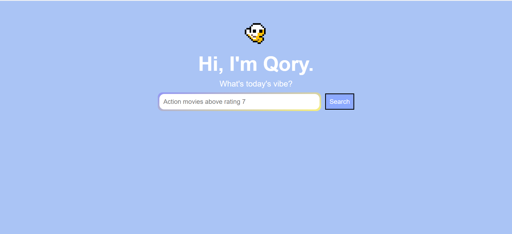

# Qory: AI Movie Search Assistant
I didn’t want to write MongoDB queries.\
I wanted to type: `“Action movies above rating 8”`\
…and just get results.

So I built **_Qory_**!\
An AI-powered movie search assistant that translates natural language into executable MongoDB filters — running entirely on my local machine using `Gemma 7B`.

No cloud.\
No fine-tuning.\
Just structured prompting and clean backend engineering.

## 🎬 The Situation
I had **4,000+** movie records \(Downloaded from Kaggle. View [Installation & Setup Guide](docs/01_Installation_&_Setup.md) for information about Dataset used.) sitting in MongoDB. Querying them manually was mechanical. Additionally, Users shouldn’t need to know: `$gt`, nested fields, `genres.name`, or JSON formatting. It is like Jonathan trying to operate radio equipment to track Jim in the _Upside Down_. 

## 🧠 The Idea
That brought me to the idea; What if:\
`Natural Language → LLM → MongoDB Query → Results`\
And it all runs locally?

That’s _**Qory**_! (She's a cute pixelated popcorn)



## ⚙️ How It Works (In 7 Seconds)
Rapid Fire of How it Works in 7s GO:
- User types a movie request
- Flask sends it to Gemma 7B (via Ollama)
- Model generates a MongoDB JSON filter
- Backend validates & parses JSON
- MongoDB executes query
- Titles are dynamically rendered

Pipeline:
```
User → Gemma 7B → JSON Filter → MongoDB → Flask → Frontend
```

## 🏗️ Tech Stack
For my dev's:
- **Backend**: Flask
- **Database**: MongoDB
- **LLM Runtime**: Ollama
- **Model**: Gemma 7B
- **Frontend**: HTML + CSS + JS
- **Dataset Size**: 4,000+ movie documents

## ✨ What Makes This Interesting
This isn’t just a search bar.\
It demonstrates:
- Prompt engineering instead of fine-tuning
- Schema-constrained AI output
- Local LLM execution
- Structured JSON validation
- Dynamic UI rendering without page reload
- Safe AI → Database integration

The model is not “trusted blindly.”\
It is constrained, cleaned, and parsed before execution.

## 📂 Project Structure
Here's a quick file structure for this project:
- Qory/
  - app.py
  - templates/
      - index.html
  - docs/
      - 01_Installation_&_SetUp.md
      - 02_Understand_app.py.md
      - 03_Understand_index.html.md
      - 04_Prompt_Guide.md
    - README.md

## 📖 Documentation
Here are the quick links for navigation through the project:
- [Installation & Setup](docs/01_Installation_&_Setup.md)
- [Understanding the logic behind it all](docs/02_Understand_app.py.md)
- [Understanding the UI of the webpage](docs/03_Understand_index.html.md)
- [Prompts & Engineering](docs/04_Prompt_Guide.md)\
Each file explains not just what I _wrote_ — but _why_.

## ⚠️ Limitations
While I was limited on time and experience, I couldn't achieve:
- No semantic ranking (yet)
- No fuzzy matching
- Complex multi-condition logic may occasionally fail
- Depends on valid JSON generation
- Runs locally — not deployed

## 🔮 What I’d Improve Next
But, that doesn't describe lack of passion. Here's what I would do next:
- Add embedding-based semantic search
- Add ranking by popularity
- Add fuzzy title matching
- Deploy to cloud environment
- Add query explanation mode

## 🎯 Why I Built This
Because I wanted to understand:
- How LLMs behave when constrained
- How prompt engineering shapes output
- How to safely connect AI systems to databases
- How local model execution differs from cloud APIs

This project bridges:
AI + Backend Systems + Structured Data

And it runs on my laptop 😎


